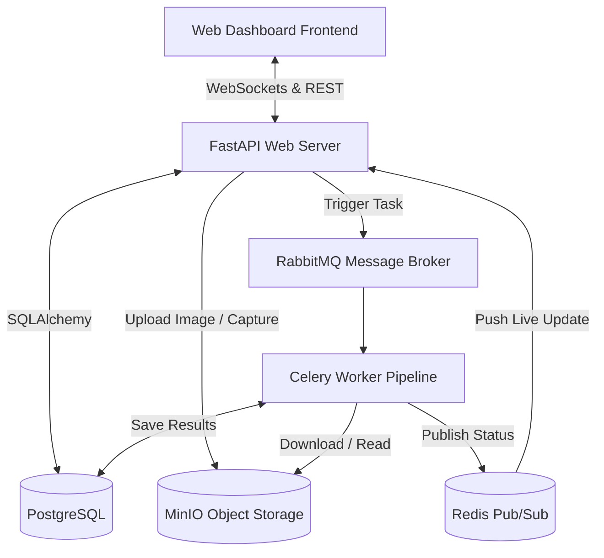

# Automated Optical Inspection (AOI) System 🔍🤖

[](https://fastapi.tiangolo.com/)
[](https://docs.celeryq.dev/)
[](https://www.docker.com/)
[](https://www.python.org/)
[](https://opensource.org/licenses/MIT)

Hệ thống **Kiểm tra Quang học Tự động (AOI)** công nghiệp hiện đại, được xây dựng dựa trên kiến trúc hướng sự kiện (Event-driven Architecture) hỗ trợ xử lý bất đồng bộ, xử lý ảnh nâng cao và phân tích lỗi lắp ráp bo mạch PCB bằng Trí tuệ Nhân tạo thông qua Cloud APIs.

---

## 🏗️ Kiến trúc Hệ thống (System Architecture)

Hệ thống được thiết kế theo cấu trúc module tách biệt giữa xử lý API, lập lịch tác vụ nền, lưu trữ dữ liệu và giao diện giám sát thời gian thực:



### ⚡ Quy trình Xử lý Ảnh (8-Step Inspection Pipeline)
Khi một bo mạch PCB được chụp ảnh hoặc tải lên, Celery worker thực thi pipeline xử lý 8 bước tuần tự:
1. **Download Image**: Tải ảnh nguyên bản từ MinIO Object Storage.
2. **Undistort Image**: Hiệu chỉnh méo thấu kính của camera công nghiệp thông qua ma trận hiệu chuẩn OpenCV (`CameraCalibration`).
3. **Validate Image Quality**: Đánh giá độ sáng, độ bão hòa màu và độ mờ Laplacian để lọc bỏ các ảnh không đạt tiêu chuẩn kiểm nghiệm.
4. **Preprocess Image**: Chuẩn hóa kích thước hình ảnh và tăng độ tương phản chi tiết với giải thuật **CLAHE (Contrast Limited Adaptive Histogram Equalization)**.
5. **Inference Engine**: Phân tích lỗi lắp ráp linh kiện bằng AI (hỗ trợ **Roboflow Cloud API** hoặc Local AI Engine, tự động fallback về **Mock Engine** khi mất kết nối).
6. **Verdict Engine**: Đánh giá trạng thái cuối cùng của bo mạch (PASS/WARNING/FAIL) dựa trên hệ luật công nghiệp và cấu hình độ tin cậy nghiêm ngặt.
7. **Persist Data**: Lưu kết quả kiểm định, danh sách lỗi phát hiện được, mức độ nghiêm trọng và lý do phán quyết vào PostgreSQL DB.
8. **Publish Real-time Event**: Đẩy sự kiện qua Redis Pub/Sub, FastAPI gửi tín hiệu ngay lập tức lên Web Dashboard qua WebSockets.

---

## ✨ Các Tính năng Nổi bật (Core Features)

* **Strategy Pattern cho Inference**: Dễ dàng chuyển đổi giữa `RoboflowDetector` (Cloud API), `MockDetector` (giả lập thông minh phục vụ phát triển cục bộ) và các Engine AI cục bộ trong tương lai mà không cần cấu trúc lại pipeline.
* **Image Quality Validator (Cổng kiểm soát chất lượng)**: Tự động loại bỏ các bức ảnh bị mờ do rung động cơ học hoặc điều kiện ánh sáng không đạt chuẩn (quá tối/quá sáng).
* **Verdict Engine (Đánh giá luật nghiêm ngặt)**: 
  * **PASS**: Bo mạch sạch lỗi hoặc lỗi nằm dưới ngưỡng tin cậy tối thiểu.
  * **WARNING**: Phát hiện lỗi ở các linh kiện ít quan trọng hoặc độ tin cậy của mô hình nằm trong khoảng cảnh báo cần con người xem xét.
  * **FAIL**: Phát hiện các lỗi nghiêm trọng (Lệch linh kiện, Thiếu linh kiện, Bắc cầu thiếc - Bridge, v.v.).
* **Operator Console (Ghi đè phán quyết)**: Cho phép kỹ sư kiểm ca ghi đè quyết định của AI (PASS/FAIL) và lưu lại ghi chú sửa lỗi trực tiếp trên màn hình giám sát.
* **Mô phỏng Phần cứng (Hardware Abstraction Layer)**: Có sẵn các Mock Drivers cho Camera công nghiệp (Gige/USB), Hệ thống chiếu sáng Modbus Serial, và Bàn trượt di chuyển XY-Stage giúp phát triển và kiểm thử dự án mà không cần phần cứng vật lý.

---

## 🛠️ Hướng dẫn Cài đặt & Sử dụng (Setup & Quickstart)

### 1. Chuẩn bị Môi trường
Yêu cầu hệ thống đã cài đặt sẵn **Docker**, **Docker Compose** và **Python 3.10+**.

### 2. Chạy Hạ tầng Services (Docker Stack)
Khởi chạy cơ sở dữ liệu PostgreSQL, Redis, RabbitMQ và MinIO:
```bash
docker compose up -d
```

### 3. Cấu hình Biến Môi trường
Sao chép file cấu hình mẫu và tùy chỉnh nếu cần thiết:
```bash
cp .env.example .env
```
*(Nếu muốn chạy suy luận AI thực tế, hãy đăng ký và cung cấp khóa `ROBOFLOW_API_KEY` trong file `.env`)*

### 4. Thiết lập Môi trường ảo Python
```bash
python3 -m venv .venv
source .venv/bin/activate
pip install -r requirements.txt
```

### 5. Khởi chạy API Web Server
```bash
uvicorn backend.main:app --host 0.0.0.0 --port 8000 --reload
```

### 6. Khởi chạy Celery Worker Pipeline
Mở một terminal mới, kích hoạt môi trường ảo và chạy:
```bash
celery -A backend.workers.celery_app.celery_app worker --loglevel=info --pool=solo
```

### 7. Trải nghiệm Giao diện Dashboard
Mở trình duyệt và truy cập file giao diện cục bộ:
```text
file:///home/duybatne/Documents/ecomercial/frontend/index.html
```
*Bạn có thể bấm **Trigger Scan** để giả lập camera công nghiệp chụp ảnh PCB, hoặc sử dụng **Upload Image** để tải lên trực tiếp bức ảnh bo mạch của mình.*

---

## 🧪 Hướng dẫn Kiểm thử (Testing)

Dự án sở hữu bộ test suite tự động hoàn chỉnh từ Unit Test đến Integration Test tích hợp:

* **Chạy toàn bộ Test Suite**:
  ```bash
  pytest
  ```
* **Chạy kiểm thử riêng lẻ theo danh mục**:
  * Unit Tests (Inference, Validator, Verdict): `pytest tests/unit/ -v`
  * API Integration Tests: `pytest tests/test_api.py -v`
  * Asynchronous Pipeline Integration: `pytest tests/test_async_pipeline.py -v`

---

## 📁 Cấu trúc Thư mục Dự án

```text
ecomercial/
├── backend/            # Web API Server (FastAPI), Models, Endpoints & Celery Tasks
│   ├── api/            # API Router & Endpoints (Inspections, WebSocket)
│   ├── models/         # SQLAlchemy DB models & Pydantic schemas
│   └── workers/        # Celery App & Task định nghĩa Pipeline 8 bước
├── core/               # Lõi xử lý logic AOI (Inference, Preprocessing, Verdict)
│   ├── calibration/    # Hiệu chuẩn ma trận camera khử méo ảnh
│   ├── inference_engine/# Nhận diện lỗi (Roboflow Cloud / Mock Detector)
│   ├── preprocessing/  # CLAHE enhancement & Image Quality Validator
│   └── verdict_engine/ # Hệ luật phán định PASS/WARNING/FAIL
├── hardware/           # Trình điều khiển kết nối phần cứng công nghiệp
│   ├── camera_drivers/ # API Camera (Mock, Basler, Allied Vision)
│   ├── lighting_control/# Điều khiển đèn chiếu sáng Modbus/Serial
│   └── motion_stage/   # Bộ trượt di chuyển khay mạch XY-Stage
├── frontend/           # Màn hình giám sát HTML/CSS/JS (Vanilla & WebSockets)
├── tests/              # Các kịch bản kiểm thử (Unit, Integration)
├── docker-compose.yml  # Định nghĩa các container PostgreSQL, Redis, RabbitMQ, MinIO
└── requirements.txt    # Danh sách thư viện Python phụ thuộc
```

---

## 📝 Giấy phép (License)
Dự án được phân phối dưới giấy phép **MIT License**. Bạn được tự do học tập, sửa đổi và sử dụng cho dự án cá nhân của mình.
